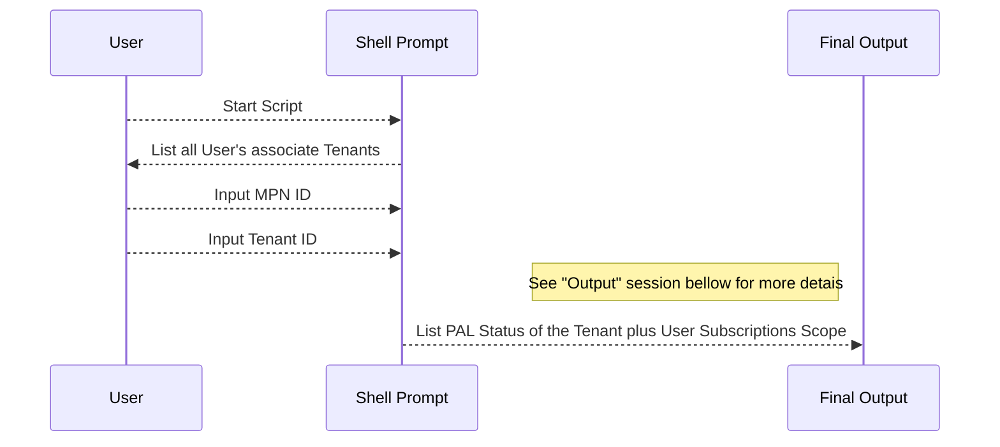

# Linking Tenants without a Partner MPN ID

The partner ID is the [Microsoft Cloud Partner Program ID](https://partner.microsoft.com/) for your organization. Be sure to use the Associated Partner ID shown on your partner profile.

<i>*Challenge proposed on August 25th 2023. #Marcos Paulo Falcirolli</i>

# How to Use

**Option 1: Run in Azure Cloud Shell**

Open the Azure portal and navigate to the Cloud Shell.

Select PowerShell as the environment.

Create a new File in Power Shell script tool and past all content of the file:

`
script/link-partner.ps1
`

Save the script with the name `link-partner.ps1` and run the script by running the following command:

`
./link-partner.ps1
`

**Option 2: Run in PowerShell on your local machine**

Install the [Azure PowerShell module](https://learn.microsoft.com/en-us/powershell/azure/install-azure-powershell?view=azps-10.3.0).

Copy the content of the file `/script/link-partner.ps1` to a local file inside of the current directory.

Run the script by running the following command:

`
./link-partner.ps1
`

Note: You may need to authenticate to your Azure account before running the script. You can do this by running the Connect-AzAccount cmdlet and following the prompts.

# Sequence Diagram



# Schema:

## Input:

```
MPN ID: [Partner MPN ID]
Tenant: [Tenant ID]
```

## Output

```
	{
		Tenant: xxxx-xxxx-xxxx-xxxx - xxx,
		PAL: Registered|Already registered, update,
		Subscriptions:	{
			(subscription: yyy, ID: xxxxx-xxxx-xxxx-xxxx, Owner: true|false, Contributor: true|false, Reader: true|false),
			(subscription: yyy, ID: xxxxx-xxxx-xxxx-xxxx, Owner: true|false, Contributor: true|false, Reader: true|false)
			...
			}
	}
```

# Documentation

[Microsoft Official Documentation](https://learn.microsoft.com/en-us/azure/cost-management-billing/manage/link-partner-id)

[Management Partner](https://learn.microsoft.com/en-us/powershell/module/az.managementpartner/?view=azps-10.2.0#management-partner)